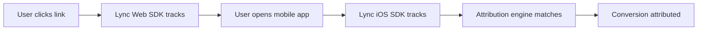

# 🎯 Lync Attribution - Web SDK

Cross-platform attribution tracking that connects web clicks to mobile app events. Now with **unified API endpoint** for seamless cross-platform consistency.

[](https://badge.fury.io/js/lync)
[](https://opensource.org/licenses/MIT)

## 🚀 Quick Start

```bash
npm install lync
```

```typescript
import { Lync } from 'lync';

// Initialize
const lync = Lync.init({
  apiBaseURL: 'https://your-lync-instance.com',
  apiKey: 'your-api-key',
  debug: true
});

// Track link clicks
const { clickId } = await lync.trackClick('link-id', {
  customProperties: { campaign: 'summer-sale' }
});

// Track conversions with full customer data
await lync.trackConversion('signup', {
  customerId: 'user-123',
  customerEmail: 'user@example.com',
  customerName: 'John Doe',
  customerAvatar: 'https://example.com/avatar.jpg',
  customProperties: { plan: 'premium' }
});

// Track custom events
await lync.trackEvent('purchase', 'Premium Plan Purchase', {
  customerId: 'user-123',
  customerEmail: 'user@example.com',
  customerName: 'John Doe',
  customerAvatar: 'https://example.com/avatar.jpg',
  customProperties: { 
    amount: 99.99, 
    currency: 'USD',
    plan: 'yearly' 
  }
});
```

## 🎯 Features

- **Unified API Endpoint**: Uses `/api/track` for seamless cross-platform consistency
- **Cross-Platform Attribution**: Match web clicks to mobile app installs
- **Device Fingerprinting**: Advanced fingerprinting for accurate attribution
- **Privacy-First**: Works without cookies or invasive tracking
- **TypeScript Support**: Full type definitions included
- **Lightweight**: < 5KB gzipped
- **Framework Agnostic**: Works with React, Vue, vanilla JS, etc.

## 📱 Cross-Platform Flow



## 🛠️ Installation & Setup

### NPM
```bash
npm install lync
```

### CDN
```html
<script src="https://unpkg.com/lync@latest/dist/index.js"></script>
```

### Initialize
```typescript
import { Lync } from 'lync';

const lync = Lync.init({
  apiBaseURL: 'https://api.lync.so',
  apiKey: 'your-api-key', // Required for tracking
  debug: process.env.NODE_ENV === 'development'
});
```

## 📊 API Reference

### `Lync.init(config)`

Initialize the Lync Attribution SDK.

```typescript
interface LyncConfig {
  apiBaseURL: string;    // Your Lync instance URL
  apiKey?: string;       // API key (required for tracking)
  debug?: boolean;       // Enable debug logging
}
```

### `lync.trackClick(linkId, data?)`

Track a link click for attribution.

```typescript
const result = await lync.trackClick('link-123', {
  clickId: 'custom-click-id',        // Optional: custom click ID
  customProperties: {                // Optional: custom data
    campaign: 'summer-sale',
    source: 'email'
  }
});

// Returns: { success: boolean, clickId: string }
```

### `lync.trackConversion(eventName, data?)`

Track a conversion event.

```typescript
await lync.trackConversion('signup', {
  customerId: 'user-123',
  customerEmail: 'user@example.com',
  customerName: 'John Doe',
  customerAvatar: 'https://example.com/avatar.jpg',
  customProperties: {
    plan: 'premium',
    value: 99.99
  }
});
```

### `lync.trackEvent(eventType, eventName, data?)`

Track any custom event with full customer information.

```typescript
await lync.trackEvent('purchase', 'Premium Plan Purchase', {
  customerId: 'user-123',
  customerEmail: 'user@example.com',
  customerName: 'John Doe',
  customerAvatar: 'https://example.com/avatar.jpg',
  customProperties: {
    amount: 99.99,
    currency: 'USD',
    plan: 'yearly'
  }
});
```

### `lync.generateWebCompatibleFingerprint()`

Generate device fingerprint for cross-platform matching.

```typescript
const fingerprint = lync.generateWebCompatibleFingerprint();
// Returns: "device:desktop;lang:en;platform:web;region:US;scale:2.0;screen:3840x2160;tz:America_New_York"
```

## 👤 Customer Data Fields

All tracking methods support comprehensive customer information for attribution and analytics:

```typescript
interface TrackingData {
  customerId?: string;      // Your app's unique user ID
  customerEmail?: string;   // User's email (for cross-device attribution)
  customerName?: string;    // User's display name
  customerAvatar?: string;  // User's profile image URL
  customProperties?: Record<string, any>; // Any custom event data
}
```

**Field Usage:**
- **`customerId`**: Your internal user identifier (e.g., `"user_12345"`, `"uuid-string"`)
- **`customerEmail`**: Email address for cross-device attribution matching
- **`customerName`**: Display name for analytics dashboards
- **`customerAvatar`**: Profile image URL for enhanced reporting
- **`customProperties`**: Any custom data specific to the event

## 🔧 Framework Examples

### React
```tsx
import { useEffect } from 'react';
import { Lync } from 'lync';

function App() {
  useEffect(() => {
    const lync = Lync.init({
      apiBaseURL: 'https://api.lync.so',
      apiKey: process.env.REACT_APP_LYNC_API_KEY!
    });

    // Track page view
    lync.trackConversion('page_view', {
      customProperties: { page: window.location.pathname }
    });
  }, []);

  const handleDownloadClick = async () => {
    const lync = Lync.init({ /* config */ });
    await lync.trackClick('download-link', {
      customProperties: { button: 'hero-cta' }
    });
  };

  return (
    <button onClick={handleDownloadClick}>
      Download App
    </button>
  );
}
```

### Vue
```vue
<template>
  <button @click="trackDownload">Download App</button>
</template>

<script>
import { Lync } from 'lync';

export default {
  methods: {
    async trackDownload() {
      const lync = Lync.init({
        apiBaseURL: 'https://api.lync.so',
        apiKey: process.env.VUE_APP_LYNC_API_KEY
      });
      
      await lync.trackClick('download-link');
    }
  }
}
</script>
```

### Vanilla JavaScript
```html
<script src="https://unpkg.com/lync@latest/dist/index.js"></script>
<script>
  const lync = Lync.init({
    apiBaseURL: 'https://api.lync.so',
    apiKey: 'your-api-key'
  });

  document.getElementById('download-btn').addEventListener('click', async () => {
    await lync.trackClick('download-link');
  });
</script>
```

## 🔒 Privacy & Compliance

- **GDPR Compliant**: No PII collected by default
- **No Cookies**: Uses localStorage/sessionStorage for click ID storage
- **Minimal Data**: Only collects necessary attribution data
- **User Control**: Respects Do Not Track headers
- **Transparent**: Open source and auditable

## 🧪 Device Fingerprinting

Lync uses privacy-friendly device fingerprinting for attribution:

```typescript
{
  screen: "1920x1080",        // Screen resolution
  scale: "2.0",               // Pixel ratio
  platform: "web",            // Platform identifier
  device: "desktop",          // Device type
  timezone: "America_New_York", // Timezone
  language: "en",             // Language preference
  region: "US"                // Region
}
```

This creates a **cross-platform fingerprint** that can match web users to mobile app users on the same device.

## 🔄 Attribution Flow

1. **Web Click**: User clicks your link → Lync Web SDK tracks via unified `/api/track` endpoint
2. **App Install**: User opens mobile app → iOS/Android SDK tracks via same `/api/track` endpoint  
3. **Attribution**: Lync matches fingerprints → Links web click to app install
4. **Insights**: View attribution data in your Lync dashboard

**New**: All platforms now use the same `/api/track` endpoint for consistent data flow and easier maintenance!

## 📈 Analytics

Track key metrics:

- **Click-to-Install Rate**: Web clicks that lead to app installs
- **Attribution Confidence**: How certain the match is (direct vs. probabilistic)
- **Time to Install**: How long between click and install
- **Campaign Performance**: Which campaigns drive the most installs

## 🛟 Support

- 📖 [Documentation](https://docs.lync.so)
- 💬 [Discord Community](https://discord.gg/lync)
- 🐛 [GitHub Issues](https://github.com/lync-so/js/issues)
- 📧 [Email Support](mailto:support@lync.so)
- 📦 [GitHub Repository](https://github.com/lync-so/js)

## 📄 License

MIT License - see [LICENSE](LICENSE) file for details.

## 🔄 Changelog

### v1.0.1 (Latest) 
- **🚀 Unified API Endpoint**: Migrated from deprecated endpoints to unified `/api/track`
- **🔧 Improved Payload Format**: Updated to match unified API specification with snake_case naming
- **📱 Cross-Platform Consistency**: Same endpoint used by iOS, Android, and Web SDKs
- **⚡ Better Performance**: Optimized data structure for faster processing
- **🛡️ Future-Proof**: Ready for new platform integrations
- **🔑 BREAKING: Simplified Auth**: Removed `entityId` from config - entity comes from API key authentication
- **👤 Enhanced Customer Data**: Added support for `customerName` and `customerAvatar` fields
- **🎯 Custom Events**: New `trackEvent()` method for tracking any custom events

### v1.0.0
- Initial release with basic attribution tracking

---

**Made with ❤️ by the Lync team** 